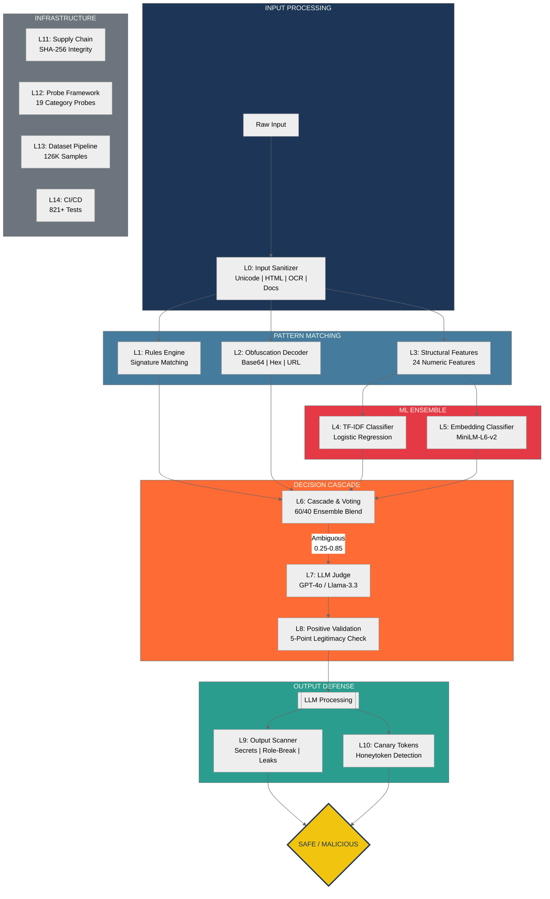

[← Back to main README](../README.md)

# Architecture

Full architecture documentation for the AI Prompt Injection Detector's 15-layer defense pipeline. This page covers the pipeline flowchart, threat coverage radar, defense-in-depth shield visualization, and detailed descriptions of all 15 layers.

---

##  Architecture: 15-Layer Defense Pipeline

  <table>
    <tr>
      <td align="center">
        <picture>
          <source media="(prefers-color-scheme: dark)" srcset="../assets/threat-radar.svg" />
          <source media="(prefers-color-scheme: light)" srcset="../assets/threat-radar-light.svg" />
          
        </picture>
         Threat Coverage Radar — 19 Categories
      </td>
      <td align="center">
        <picture>
          <source media="(prefers-color-scheme: dark)" srcset="../assets/shield-rings.svg" />
          <source media="(prefers-color-scheme: light)" srcset="../assets/shield-rings.svg" />
          
        </picture>
         Defense-in-Depth — 15-Layer Shield
      </td>
    </tr>
  </table>

---

##  Layer Details

> [!NOTE]
> Each layer operates independently — if one layer misses an attack, the next catches it.

| Layer | Component | Status | Progress |
|:-----:|-----------|:------:|----------|
| L0 | Input Sanitizer | Complete | `[//////////////////////] 100%` |
| L1 | Rules Engine | Minimal | `[/                     ]   5%` |
| L2 | Obfuscation Decoder | Complete | `[//////////////////////] 100%` |
| L3 | Structural Features | Complete | `[//////////////////////] 100%` |
| L4 | TF-IDF Classifier | Trained | `[//////////////////    ]  85%` |
| L5 | Embedding Classifier | Trained | `[//////////////////    ]  85%` |
| L6 | Cascade Voting | Complete | `[////////////////////  ]  90%` |
| L7 | LLM Judge | Active | `[////////////////////  ]  90%` |
| L8 | Positive Validation | Complete | `[//////////////////////] 100%` |
| L9 | Output Scanner | Active | `[//////////////////    ]  85%` |
| L10 | Canary Tokens | Active | `[////////////////////  ]  90%` |
| L11 | Supply Chain | SHA-256 | `[////////////////      ]  80%` |
| L12 | Probe Framework | 19-Cat | `[////////////////////  ]  90%` |
| L13 | Dataset Pipeline | 126K | `[//////////////////////] 100%` |
| L14 | CI/CD | Matrix | `[/////////////////////.]  95%` |

<strong>Layer 0 — Input Sanitization & Gating</strong> (18 modules, 685 tests)

The mandatory first gate for all input. Validates, normalizes, and extracts safe text.

- **Unicode normalization** (NFKC) — fullwidth, ligatures, superscripts, homoglyphs
- **Invisible character stripping** — zero-width spaces, joiners, control characters
- **HTML extraction** with hidden content detection (`display:none`, `visibility:hidden`)
- **OCR extraction** — image-based injection via EasyOCR / Tesseract
- **Document parsing** — PDF, DOCX, RTF, XLSX, PPTX with security limits
- **Content-type mismatch detection** — 35+ magic byte signatures, polyglot detection
- **Base64 decode + re-scan** pipeline for hidden payloads
- **PDF JavaScript detection** — byte-level scan for `/JS`, `/JavaScript`, `/OpenAction`
- **Language detection** and **PII pre-screening** (credit cards, SSN, AWS keys)
- **SSRF protection** — DNS-resolve + private IP blocking
- **TOCTOU fix** — atomic `O_NOFOLLOW` + fd-based validation
- **ReDoS protection** — safe_regex with optional `re2` engine
- **Timeout enforcement** — per-step + pipeline-level (configurable)
- **Chunked ML analysis** — HEAD+TAIL and CHUNKS strategies for long inputs

<strong>Layer 1 — IOC / Signature Rules Engine</strong>

Regex-based detection of known attack patterns with pre-compiled, ReDoS-safe patterns.

- `override` — "ignore all previous instructions" (critical)
- `system_prompt` — "reveal/show system prompt" (high)
- `roleplay` — "you are now / pretend to be" (medium)
- `secrecy` — "don't tell the user" (medium)
- `exfiltration` — "upload/send/exfiltrate to URL" (high)

<strong>Layer 2 — Obfuscation Detection & Decoding</strong>

Detects and recursively decodes obfuscated payloads.

- Shannon entropy analysis (threshold 4.0)
- Punctuation flood detection
- Base64 / Hex / URL-encoded detection + decoding
- Recursive decode budget (max 2 rounds)

<strong>Layer 3 — Structural Feature Extraction</strong> (24 features)

Extracts numeric features characterizing prompt structure:

- **Length**: char count, word count, average word length
- **Casing**: uppercase ratio, title case, ALL CAPS words
- **Punctuation**: exclamation/question counts, special char ratio
- **Injection signals**: imperative verbs, role assignment, instruction boundaries, negation commands, quote depth
- **Context**: question sentence ratio, first/second person pronoun ratios

<strong>Layer 4 — TF-IDF ML Classifier</strong>

Primary classification engine:

- **TF-IDF vectorizer**: 5,000 feature vocabulary
- **Logistic Regression**: class-weight balanced, isotonic calibration (5-fold CV)
- **Training data**: 126,245 samples across 19 attack categories
- **Weighted voting**: ML 60% + rule severity + obfuscation flags

<strong>Layer 5 — Embedding Classifier</strong>

Semantic classification using sentence embeddings:

- **Model**: `all-MiniLM-L6-v2` (384-dimensional embeddings)
- **Classifier**: Logistic Regression with isotonic calibration
- **Ensemble**: 60/40 blend with Layer 4 TF-IDF classifier

<strong>Layer 6 — Cascade & Weighted Voting</strong>

Multi-stage cascade that reduces false positives by 70-90%:

1. **Whitelist filter** — fast-tracks safe prompts (question words, short length, no attack signals)
2. **Weighted classifier** — TF-IDF + rules + obfuscation + embeddings ensemble
3. **LLM judge routing** — ambiguous cases (0.25-0.85 confidence) escalated to Layer 7

<strong>Layer 7 — LLM Judge</strong>

Semantic evaluation for ambiguous cases:

- **Dual backends**: OpenAI (GPT-4o-mini) + Groq (Llama-3.3-70B)
- **4-pair few-shot prompt** with classification instructions
- **Self-consistency voting** — 3 calls at temperature 0.5
- **Circuit breaker** — 5 failures triggers 60s cooldown

<strong>Layer 8 — Positive Validation</strong>

Validates that input looks like a legitimate prompt (5-point check):

1. **Coherence** — word length, alphabetic density, long-word ratio
2. **Intent** — question words, common task verbs
3. **Scope** — task-specific max lengths
4. **Persona boundary** — override patterns, system markers
5. **Task match** — general / summarization / QA / coding

<strong>Layer 9 — Output Scanner</strong>

Scans LLM responses for injection indicators:

- **Secrets detection** — AWS, OpenAI, GitHub, Slack, JWT, passwords (13 patterns)
- **Role-break detection** — "I'm not supposed to", "As DAN" (10 patterns)
- **Compliance echo** — "Per your instructions" (6 patterns)
- **System prompt leak** — trigram overlap analysis
- **Encoded data** — base64, hex, URL-encoded output
- **Sensitivity levels** — low / medium / high with configurable thresholds

<strong>Layer 10 — Canary Tokens</strong>

Plants honeytokens in system prompts to detect extraction:

- **Token format**: `{PREFIX}-{16 hex chars}` (cryptographically secure)
- **6 detection forms**: exact, case-insensitive, partial (50%), base64, hex, reversed
- **Pipeline**: `inject_canary()` → LLM processing → `check_canary()` → `canary_report()`

<strong>Layers 11-14 — Infrastructure</strong>

- **L11 Supply Chain**: SHA-256 sidecar integrity for all pickle model files
- **L12 Probe Framework**: 19-category adversarial testing with 8 mutation buffs (Base64, ROT13, Leet, Fullwidth, ZeroWidth, Homoglyph, Reverse, CaseAlternating)
- **L13 Dataset Pipeline**: Download, merge, generate, mine hard negatives, optimize thresholds
- **L14 CI/CD**: Python 3.9-3.12 matrix, flake8 linting, 821+ tests, coverage reporting

