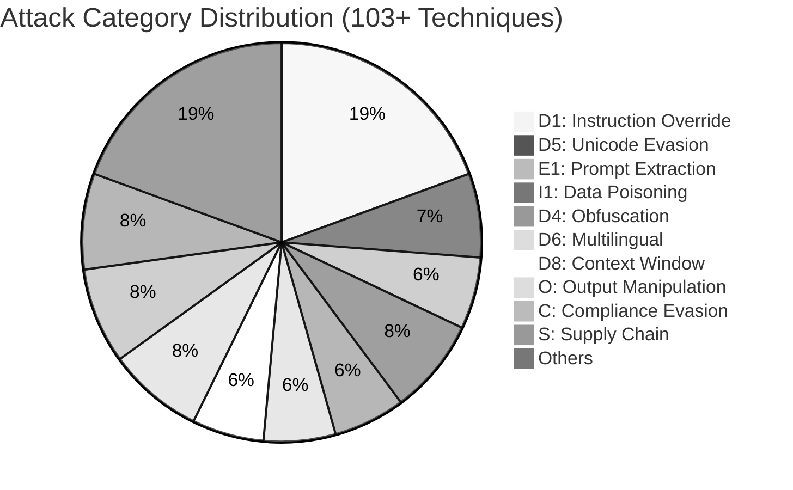
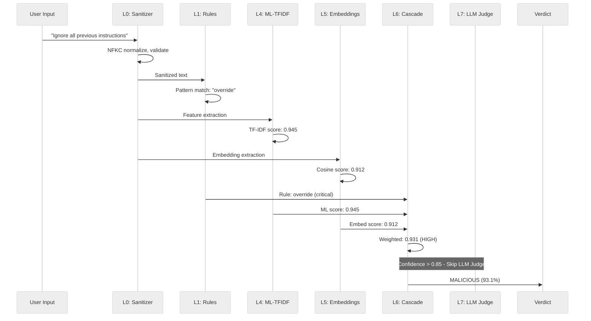

[← Back to main README](../README.md)

# Threat Taxonomy Coverage

This page documents the 19 attack categories and 103+ techniques covered by the AI Prompt Injection Detector. For the complete taxonomy definition including all technique IDs, descriptions, and example payloads, see [`THREAT_TAXONOMY.md`](../THREAT_TAXONOMY.md).

---

##  Threat Taxonomy Coverage

19 attack categories with **103+ techniques**, mapped to [OWASP LLM Top 10 2025](https://genai.owasp.org/), AVID, and LMRC frameworks.

| Category | Name | Techniques | Coverage |
|:--------:|------|:----------:|:--------:|
| **D1** | Instruction Override | 20 |  |
| **D2** | Persona / Roleplay Hijack | 4 |  |
| **D3** | Structural Boundary Injection | 4 |  |
| **D4** | Obfuscation / Encoding | 6 |  |
| **D5** | Unicode Evasion | 7 |  |
| **D6** | Multilingual Injection | 6+ |  |
| **D7** | Payload Delivery Tricks | 5 |  |
| **D8** | Context Window Manipulation | 6 |  |
| **E1** | System Prompt Extraction | 6 |  |
| **E2** | Active Reconnaissance | 5 |  |
| **I1** | Data Source Poisoning | 8+ |  |
| **I2** | HTML / Markup Injection | 3 |  |
| **A** | Adversarial ML | 5 |  |
| **O** | Output Manipulation | 8+ |  |
| **T** | Agent / Tool Abuse | 7+ |  |
| **C** | Compliance Evasion | 8+ |  |
| **P** | Privacy / Data Leakage | 6+ |  |
| **R** | Resource / Availability | 5 |  |
| **S** | Supply Chain | 8+ |  |

<strong>Attack Category Distribution (click to expand)</strong>

 

<strong>Detection Flow — Sequence Diagram (click to expand)</strong>

 

